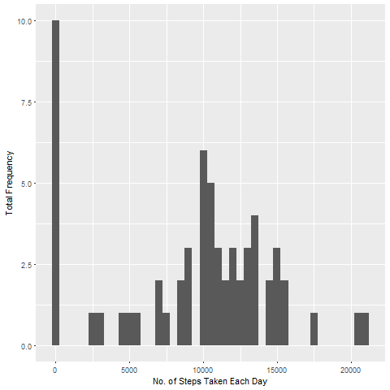
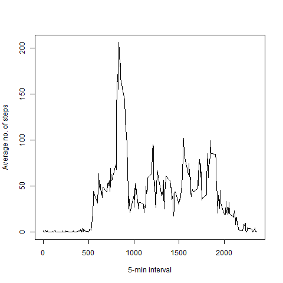
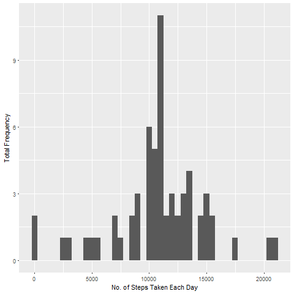

# Reproducible Research: Peer Assessment 1


## Loading and preprocessing the data


```r
setwd("C:/Users/Kanha/Desktop/Coursera/repdata_data_activity")

data<- read.csv("activity.csv")
data$date<- as.Date(data$date)
```

## What is mean total number of steps taken per day?


```r
stepsbyday<- tapply(data$steps, data$date, sum, na.rm=TRUE)
library(ggplot2)

qplot(stepsbyday, xlab="No. of Steps Taken Each Day", ylab="Total Frequency", binwidth=500)
```

<!-- -->

```r
medianbyday<- median(stepsbyday)
meanbyday<- mean(stepsbyday)
```

- Median = 10395
- Mean = 9354.2295082

## What is the average daily activity pattern?


```r
avg<- tapply(data$steps, data$interval, mean, na.rm=TRUE)

plot(names(avg), avg, xlab="5-min interval", type="l", ylab="Average no. of steps")
```

<!-- -->

```r
maxavg<- max(avg)
maxinterval<- as.numeric(names(avg)[which(avg==max(avg))])
```
- 5-minute interval : 835
- Max Average Value : 206.1698113

## Imputing missing values


```r
totalna<- sum(is.na(data$steps))
```

- Total NAs : 2304


```r
imputedata<- data


imputedata$steps[which(is.na(data$steps))]<- as.vector(avg[as.character(data[which(is.na(data$steps)),3])])


stepseachday<- tapply(imputedata$steps, imputedata$date, sum, na.rm=TRUE)

qplot(stepseachday, xlab="No. of Steps Taken Each Day", ylab="Total Frequency", binwidth=500)
```

<!-- -->

```r
medianEachDayImputed<- median(stepseachday)
meanEachDayImputed<- mean(stepseachday)
```

- Mean Total No. of Steps Taken Per Day : 1.0766189\times 10^{4}
- Median Total No. of Steps Taken Per Day : 1.0766189\times 10^{4}

## Are there differences in activity patterns between weekdays and weekends?


```r
imputedata$dayType<- ifelse(as.POSIXlt(imputedata$date)$wday %in% c(0,6), "weekends","weekdays")


aggregateData<- aggregate(steps ~ interval + dayType, data=imputedata, mean)

ggplot(aggregateData, aes(interval, steps)) + 
  geom_line() + 
  facet_grid(dayType ~ .) +
  xlab("5-minute interval") + 
  ylab("avarage number of steps")
```

<!-- -->
